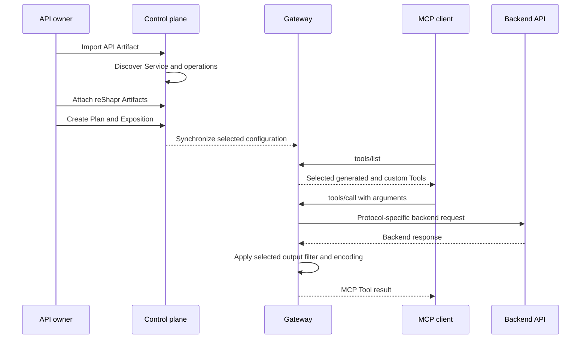

# From API Contract to Agent Action

An API operation and an MCP Tool are related, but they are not the same contract. reShapr translates backend-oriented definitions into MCP capabilities, then lets a Configuration Plan select and reshape what an agent can use.

## The transformation path



## 1. Import discovers the backend contract

The main API Artifact provides operations and schemas. reShapr discovers a versioned Service from an OpenAPI document, GraphQL schema, or Protocol Buffer definition. This stage describes what the backend can do; it does not yet decide what a particular agent should see.

## 2. Attached Artifacts add agent-oriented capabilities

Prompts, Resources, Custom Tools, and output filters enrich the Service without changing the backend contract. A declarative Custom Tool can present a more intentional name, description, and input schema over a generated operation. A scripted Custom Tool can orchestrate several calls, but it introduces code and should be chosen only when declarative mapping is insufficient.

## 3. A Plan selects the MCP surface

The Configuration Plan determines which Service operations and attached Artifacts apply. Operation selection controls generated Tools. Artifact selection controls additional Prompts, Resources, Custom Tools, and filters.

This allows two Plans for the same Service to expose different contracts. The backend API remains unchanged, while each MCP client receives only the surface selected by its Exposition.

## 4. `tools/list` describes the selected contract

When a client lists Tools, the Gateway converts selected Service operations into MCP Tool schemas and includes selected Custom Tools. Tool names, descriptions, and input schemas are context sent to the client; reducing this list reduces the contract the client must inspect.

The Tool list is not an authorization decision by itself. Endpoint authentication protects the Exposition, and backend credentials protect the backend boundary. reShapr does not apply different OAuth scopes to individual Tools in a single Exposition.

## 5. `tools/call` dispatches to the backend

The Gateway validates the requested Tool and arguments, maps the call to the REST, GraphQL, or gRPC backend contract, and applies configured backend credentials. A declarative Custom Tool still targets a generated operation; its stable agent-facing contract can remain unchanged while mapping details evolve with the Plan and Artifact.

## 6. Response treatment happens before MCP delivery

A selected output filter can retain JSON branches, apply JSON Patch operations, and encode the resulting data as TOON. For the `0.2.3` baseline, these stages run in that order:

```text
backend JSON -> jsonRetain -> jsonPatches -> TOON (optional) -> MCP Tool result
```

Filtering changes the content returned by a call. TOON changes its encoding. Neither mechanism reduces the number of Tools advertised by `tools/list`; operation and Artifact selection do that earlier.

## Contracts and data cross different boundaries

| Flow | Content | Controlled by |
|---|---|---|
| Control plane to Gateway | Exposition configuration and selected Artifacts | Organization, Plan, and Gateway Group |
| MCP client to Gateway | Tool discovery and calls | Exposition authentication and MCP protocol |
| Gateway to backend | Translated API request | Backend endpoint and Secret |
| Gateway to MCP client | Tool result after selected treatment | Output filter and encoding |

Protecting one boundary does not protect another. See **[Security Capabilities and Limits](./security-model.md)** for the separation between endpoint and backend credentials.

## What makes an action agent-oriented

An agent-oriented action is not merely a renamed endpoint. It has a bounded purpose, an understandable description, a small input contract, and a response containing what the caller needs. Context Control provides several mechanisms for reaching that result; **[Context Control: Mechanisms and Trade-offs](./context-control.md)** explains how to choose among them.