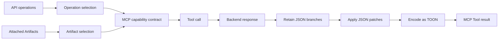

# Context Control: Mechanisms and Trade-offs

Context Control is the deliberate design of the MCP contract and Tool results presented to a model. The goal is not simply to minimize bytes. It is to expose the smallest useful action surface while preserving the information required for a correct task.

## The mechanisms act at different stages

| Mechanism | Changes | Best used when | Trade-off |
|---|---|---|---|
| **Included or excluded operations** | Generated Tools visible from the Service | The backend has operations irrelevant to the consumer | Couples the Plan to backend operation names |
| **`includedArtifacts`** | Additional Prompts, Resources, Custom Tools, and output filters | Consumers need different capability bundles from one Service | An empty selection means all attached Artifacts, so deletion requires care |
| **Declarative Custom Tool** | Tool name, description, input schema, and mapping to one generated Tool | A backend operation needs a stable, agent-oriented contract | Mapping must be maintained when the target operation changes |
| **Scripted Custom Tool** | A composed action that can invoke allowed Tools | One action requires orchestration or conditional logic | Adds code, runtime limits, and a larger maintenance surface |
| **`jsonRetain`** | Branches present in a JSON Tool result | The backend returns useful data mixed with large irrelevant branches | Required fields can be removed accidentally |
| **`jsonPatches`** | Shape or values of a JSON Tool result | The client needs a stable response shape or small transformation | Patch paths depend on the backend response structure |
| **TOON** | Encoding of the treated result | Repetitive structured data benefits from a more compact representation | The client or model must interpret TOON; semantics are unchanged |

## Reduce the advertised operation surface

Start with operation selection when the problem is too many generated Tools. An allowlist is usually easier to review than a denylist because every exposed operation is explicit. In reShapr, `includedOperations` takes precedence when both lists are present; with neither list, all Service operations are available.

This choice affects Tool discovery, not backend permissions. The backend should still enforce its own authorization policy.

## Replace protocol detail with a business action

Use a declarative Custom Tool when the useful action maps to one generated Tool but needs a clearer contract. Use a scripted Custom Tool only when the action must combine calls or perform logic that declarative argument mapping cannot express.

Custom Tools do not automatically make an operation safer or its result smaller. Pair them with operation selection and output filtering according to the actual task.

## Select capability bundles per consumer

Attach reusable Artifacts to the Service, then use `includedArtifacts` to select them per Plan. This supports, for example, one Plan with only a weather Tool and another with the same Tool plus Prompts and Resources.

Selection uses Artifact names, while derived capabilities show what each custom Artifact declares:

- Prompt names for a Prompts Artifact;
- Tool names for a Custom Tools Artifact;
- Resource and Resource Template URIs for a Resources Artifact;
- target Tool names for an output-filter Artifact.

These capability names are composition metadata. They help a user choose Artifacts but do not themselves add another runtime authorization layer.

## Treat the response after the call

Use `jsonRetain` to keep only required branches, then `jsonPatches` for explicit RFC 6902 transformations. Enable TOON only after the JSON result has the intended information and shape. In the `0.2.3` runtime, the order is fixed: retain, patch, then encode.

Filters fail open in `0.2.3`: if a selected filter cannot parse or transform the response, the Gateway returns the original response. This avoids replacing a successful backend call with a filtering failure, but it means filtering must not be treated as a security boundary for removing sensitive fields.

## Three common decisions

### Too many Tools are visible

1. Start with an operation allowlist.
2. Exclude attached Custom Tool Artifacts that this consumer does not need.
3. Verify the result with `tools/list`.

### Low-level operations do not express the user task

1. Prefer one declarative Custom Tool over exposing several implementation-oriented operations.
2. Use a scripted Tool only if orchestration is required.
3. Keep only the generated target operations required by the Custom Tool.

### Tool results are too large or unstable

1. Retain only fields required by the task.
2. Patch the shape only when a stable transformation is needed.
3. Consider TOON after content reduction, not as a substitute for it.
4. Compare payloads using the same request and a published byte-counting method.

## Measure without overclaiming

Measure the exact Tool list or response produced by two named configurations. Record the request, protocol version, filter, encoding, date, and byte-counting command. A reduction observed for one API response does not establish a universal token reduction or improved model accuracy.

Continue with **[From API Contract to Agent Action](./api-to-agent.md)** for the complete request flow. The **[Custom Tools](../references/custom-tools-specification.md)** and **[Tools Output Filtering](../references/spec-outtools-filtering.md)** pages remain the syntax references.