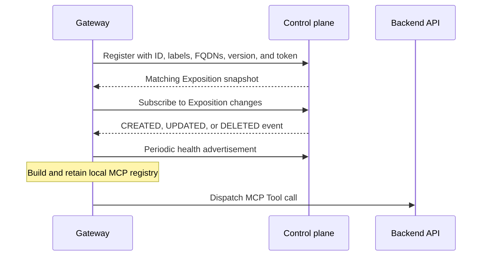

# Control Plane to Gateway Synchronization

A reShapr Gateway builds its local MCP surfaces from configuration owned by the control plane. It receives an initial snapshot during registration and then listens for Exposition changes over a gRPC stream.

This is configuration propagation, not remote request proxying: MCP clients call the Gateway, and the Gateway calls the configured backend.

## Synchronization sequence

The Gateway initiates the control-plane connections. Registration, discovery, health, and change streaming use the control-plane host, port, transport mode, and Gateway API token configured in the Gateway runtime.

## 1. Register and fetch a snapshot

At startup, the Gateway sends:

- its unique Gateway ID;
- its labels;
- the FQDNs advertised for MCP access;
- its runtime version.

The Gateway API token authenticates the gRPC calls. It is an infrastructure credential and is distinct from an API key or OAuth token used by an MCP client.

The control plane registers the ephemeral Gateway representation and returns the Expositions selected for its labels. This response is the initial snapshot used to populate the Gateway's local registry. A Gateway that has not completed this discovery does not yet have a synchronized MCP surface.

Gateway Group labels determine selection. One Gateway can match several groups, and one group can target several Gateways. Labels select configuration; they do not create network isolation or guarantee a service level.

## 2. Stream configuration changes

After initial discovery, the Gateway subscribes to the Exposition change stream. The released protocol defines three event types:

| Event | Gateway action |
|---|---|
| `CREATED` | Fetch the selected Artifacts and add the Exposition's MCP surface to the local registry |
| `UPDATED` | Fetch the selected Artifacts and replace the affected local Exposition |
| `DELETED` | Remove that Exposition from the local registry |

The control plane filters events according to Gateway Group matching. The Gateway retries a failed stream subscription with backoff, while the initial registration and snapshot remain a separate startup step.

Applying these events does not require a process restart. That property is accurately described as **live configuration propagation**. It does not prove that every request remains available during an update, process rollout, backend failure, or network partition.

## 3. Advertise health

The Gateway sends a health advertisement every two minutes after an initial delay. The control plane records the latest successful advertisement for the registered Gateway.

The control plane runs stale-registration cleanup every five minutes and selects registrations whose last health advertisement is older than five minutes. Because cleanup is scheduled, five minutes is a threshold rather than an exact removal deadline.

When a health response is not acknowledged, the Gateway requests registration and initial discovery again. A transport exception is logged; it does not by itself clear the Gateway's local registry. The change stream has its own retry behavior.

## 4. Operate through a connectivity loss

An already initialized Gateway keeps the local configuration it last fetched while synchronization is unavailable. Existing MCP surfaces can therefore remain usable when their local process, client route, credentials, and backend are healthy.

During that period:

- new or changed Expositions might not be visible locally;
- deleted Expositions might remain until synchronization resumes;
- token, backend, identity-provider, or local network failures can still prevent calls;
- a restarted Gateway still needs successful initial discovery before it can rebuild its registry.

This behavior is not an offline-operation or availability guarantee. Monitor both Gateway health and configuration freshness according to the requirements of your environment.

## 5. Shut down

On an orderly shutdown, the Gateway cancels its change-stream subscription and sends a shutdown advertisement. The control plane can then remove its ephemeral Gateway registration.

If the shutdown advertisement cannot be delivered, stale-registration cleanup provides eventual removal. Stopping a Gateway does not delete its Gateway Group, Expositions, Services, or Configuration Plans.

## Protocol ownership

The release-tagged [`eds-v1.proto`](https://github.com/reshaprio/reshapr/blob/0.2.3/api/src/main/proto/eds-v1.proto) owns the discovery snapshot and change-event contract. [`ghs-v1.proto`](https://github.com/reshaprio/reshapr/blob/0.2.3/api/src/main/proto/ghs-v1.proto) owns health and shutdown advertisements.

The tracked [Gateway runtime](https://github.com/reshaprio/reshapr/blob/0.2.3/proxy/src/main/java/io/reshapr/proxy/ReshaprGatewayApp.java), [health advertiser](https://github.com/reshaprio/reshapr/blob/0.2.3/proxy/src/main/java/io/reshapr/proxy/health/HealthAdvertiser.java), and [registration cleaner](https://github.com/reshaprio/reshapr/blob/0.2.3/control-plane/src/main/java/io/reshapr/ctrl/control/GatewayRegistrationCleaner.java) define the `0.2.3` runtime behavior.

## Limits

- Configuration streaming does not provide transactional changes across several Expositions.
- Stream retry and health re-registration do not replace readiness checks, alerting, or operational recovery procedures.
- Retaining the last local registry does not guarantee that its credentials, backend routes, or external dependencies remain valid.
- Live propagation is not a zero-downtime deployment, upgrade, or rollback guarantee.
- This page describes release `0.2.3`; timing and recovery behavior can change in later releases.

## Next step

Use **[Deployment Models and Trust Boundaries](./deployment-models-trust-boundaries.md)** to place this synchronization channel in its wider network context. Then use **[Deploy a Hybrid Gateway](../how-to-guides/deploy-hybrid-gateway.md)** to register a Gateway, or **[Troubleshoot an Exposition or Gateway](../how-to-guides/operations/troubleshoot.md)** to diagnose registration and propagation failures.