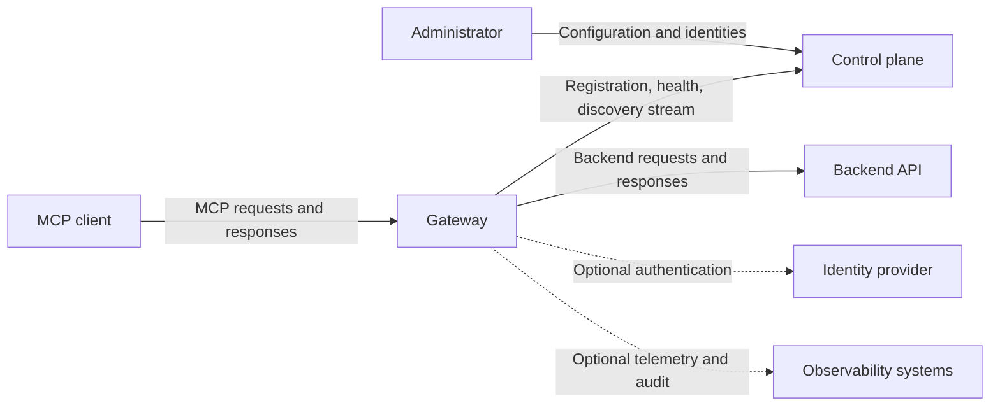

# Deployment Models and Trust Boundaries

reShapr separates configuration management from MCP request execution. The control plane stores and distributes desired configuration; Gateways expose MCP endpoints and call backend APIs. You can place those components in one environment or split them across trust domains.

Placement changes who operates each component and which networks data crosses. It does not, by itself, guarantee availability, isolation, or data residency.

## Planes and flows

These flows cross different trust boundaries:

1. **Administrator to control plane:** users, service accounts, and API tokens authorize management operations.
2. **Gateway to control plane:** a Gateway API token authenticates registration, discovery, and health traffic. This token is distinct from MCP endpoint credentials.
3. **MCP client to Gateway:** an Exposition can use no authentication, an API key, or OAuth bearer JWT validation.
4. **Gateway to backend:** a Configuration Plan and backend Secret determine how the Gateway authenticates to the API.
5. **Gateway to external systems:** identity, elicitation, audit, and telemetry integrations can introduce additional network and storage boundaries.

Protect and review each boundary independently. Securing the MCP endpoint does not secure the backend connection, and encrypting control-plane storage does not configure TLS for public Gateway traffic.

## Compare deployment models

| Model | Component placement | Main benefit | Operational responsibility |
|---|---|---|---|
| Local development | Control plane, Gateway, database, and optional Web UI on one workstation or development network | Short feedback loop | The developer operates the complete temporary environment |
| Centralized | Control plane and Gateways in one managed environment, whether a data center or cloud account | One platform boundary and shared operations | The environment owner operates runtime, persistence, networking, and availability |
| Hybrid or split | Control plane in one trust domain; one or more Gateways close to clients or backends in another | Local backend connectivity and independently placed data planes | Control-plane and Gateway owners share connectivity, credentials, rollout, and incident responsibilities |
| Self-hosted or on-premises | Control plane, Gateways, and persistence inside infrastructure operated by the organization | Direct ownership of the complete platform boundary | The organization operates every component and dependency |

A topology can combine these models. For example, one control plane can synchronize Gateways in several clusters or namespaces. Gateway Group labels select which Expositions each Gateway receives; labels do not create a network or security boundary on their own.

Commercial availability, support, and service levels are separate from the runtime topology and are not inferred from these models.

## Understand data location

The control plane holds the configuration required to build MCP surfaces, including Services, Artifacts, Configuration Plans, Expositions, Gateway Groups, and configured Secret material. Selected configuration is propagated to matching Gateways.

MCP requests are handled by the Gateway, which dispatches Tool calls to the configured backend. The control plane is not the application-data proxy in this path. However, this does not mean that all related data stays in the Gateway's environment:

- a backend endpoint can be outside the local trust domain;
- OAuth and OIDC flows can contact an external identity provider;
- audit events and telemetry can be exported to other systems;
- credentials stored in the control plane cross the synchronization boundary when required by a Gateway;
- locally resolved `${env:VARIABLE}` references keep the resolved value in the Gateway runtime, but the reference remains part of control-plane configuration.

Map the actual endpoints and integrations for your deployment before making a residency claim.

## Plan network access

The Gateway initiates its registration, health, and discovery connections to the control plane. A hybrid Gateway therefore needs an egress path to the control-plane gRPC endpoints; the control plane does not initiate a separate inbound connection to the Gateway for synchronization.

Other paths remain necessary:

- MCP clients need access to the Gateway's advertised endpoint.
- The Gateway needs access to every backend selected by its Configuration Plans.
- OAuth, elicitation, audit, and telemetry integrations need access to their configured endpoints.
- Administrators and automation need access to the control-plane interfaces they use.

Control-plane transport can be configured for plaintext or TLS. Use authenticated TLS across trust domains and treat plaintext as a bounded development choice. Public Gateway TLS remains a deployment responsibility, such as an ingress, load balancer, or service mesh configured with certificates.

## Assign availability responsibilities

Separating control and data planes can let an already synchronized Gateway retain local configuration during a temporary control-plane connectivity failure. It does not guarantee uninterrupted traffic: process restarts, missing initial discovery, expired credentials, backend failures, network policy, and local capacity can still make an endpoint unavailable.

Likewise, streamed configuration changes avoid restarting the Gateway, but they do not guarantee zero-downtime upgrades or rollback. Define availability, recovery, token rotation, persistence, and observability for every environment that owns part of the topology.

## Limits

- This page describes runtime placement and trust boundaries, not commercial deployment entitlements.
- Gateway Group labels express selection criteria, not tenant isolation, network policy, or service levels.
- The topology alone does not prove that data remains within a jurisdiction or trust domain.
- Local Secret references currently provide the `env` resolver; they do not constitute a general external secret-provider integration.
- Availability depends on the control plane, Gateway, persistence, backend, identity, and network components selected by the operator.

## Next step

Use **[Control Plane to Gateway Synchronization](./control-plane-gateway-synchronization.md)** to understand registration and configuration propagation. Then use **[Deploy a Hybrid Gateway](../how-to-guides/deploy-hybrid-gateway.md)** to run a published Gateway image in another trust domain.

For endpoint and backend authentication controls, see **[Security Model](./security-model.md)**.