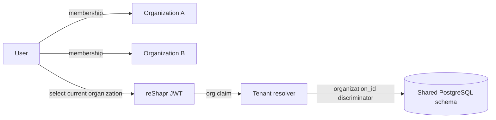
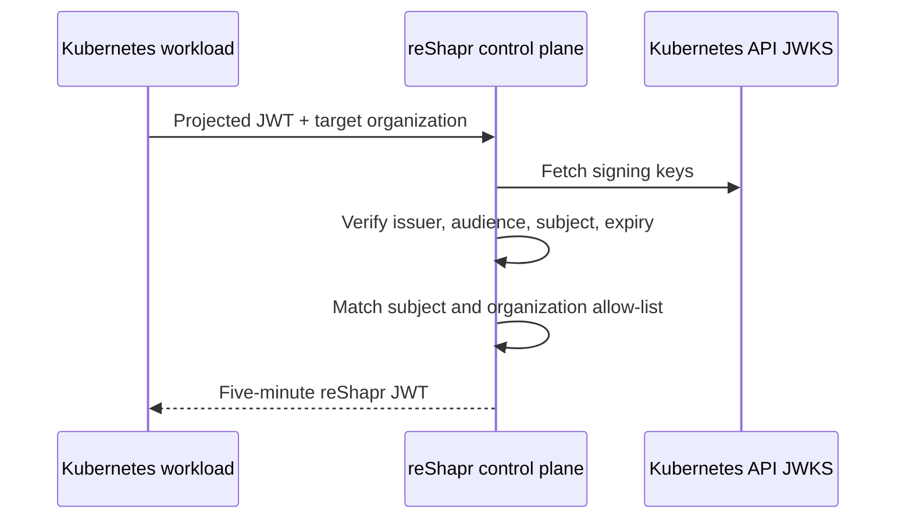

# Multi-tenancy and Administrative Governance

reShapr uses organizations as its logical ownership and tenancy boundary. Services, Artifacts, Configuration Plans, Expositions, Secrets, Gateway Groups, Gateways, API tokens, and quotas belong to an organization. The current control plane separates their application queries by an organization discriminator in a shared PostgreSQL schema.

This model provides logical application-level tenancy. It does not create a database, schema, Kubernetes namespace, cluster, network boundary, encryption key, or control-plane process per organization.

## Organization context selects the tenant

An authenticated user can belong to several organizations, but each product API request runs in one current organization context. The resulting JWT carries that organization, and the control plane uses it to select tenant-aware rows.

A membership grants the user access to an organization through the normal identity flow. It does not provision infrastructure isolation. A user's default organization selects an initial context; switching organization changes the context for later API calls rather than merging data from several organizations into one request.

An organization can have one owner. Ownership is administrative metadata and affects offboarding behavior; it is not a substitute for membership checks or deployment isolation.

Use **[Manage Organizations, Owners, and Memberships](../how-to-guides/administration/organizations-and-memberships.md)** to create this boundary and grant users access through the Web UI, CLI, or administration API.

## Keep identity types separate

reShapr uses different credentials at different boundaries:

| Identity or credential | Boundary | Scope and purpose |
|---|---|---|
| User JWT | User or CLI to public control-plane APIs | Represents one user in one current organization context |
| Control-plane admin API key | Administrator to admin APIs | Authorizes global administration across organizations |
| Kubernetes service account exchange | Kubernetes workload to public control-plane APIs | Produces a short-lived reShapr JWT for one allowed organization |
| Gateway API token | Gateway to control plane | Registers a Gateway and authorizes discovery and health traffic for its organization |
| MCP endpoint API key | MCP client to Gateway | Protects Expositions created from one Configuration Plan |
| MCP OAuth bearer JWT | MCP client to Gateway | Authenticates a caller and enforces the issuer, claim, and Exposition-scope policy |

These credentials are not interchangeable. In particular, a Gateway API token does not authorize an MCP client, and a Configuration Plan API key does not grant administrative access to the control plane.

## Administrative access is global

Administrative API routes require the control plane's `x-reshapr-api-key`. The CLI reads the same key from `RESHAPR_ADMIN_API_KEY` or an explicit option when running `reshapr admin` commands.

This key can create and remove users and organizations, replace memberships, manage service accounts, and assign quotas. It is not scoped to one organization in release `0.2.3`. Treat it as a platform-wide privileged credential:

- keep it in an approved secret manager;
- expose it only to dedicated administration workloads;
- do not pass it as a command argument when the environment-variable path is available;
- restrict administrative network access independently;
- audit its use through the surrounding platform controls.

The admin API key is a deployment bootstrap and administration credential. It is distinct from the user JWT used by normal CLI commands.

## Workload identity with Kubernetes service accounts

An administrator can register a reShapr service-account record with:

- a unique reShapr name;
- a Kubernetes subject in `namespace:service-account-name` form;
- an expiry time;
- an allow-list of organization names, or `*` for every organization.

A Kubernetes workload presents its projected service-account JWT and names the target organization. In the `0.2.3` same-cluster flow, the control plane:

1. verifies the JWT signature with the local Kubernetes API server's JWKS;
2. requires the Kubernetes issuer, expiration, subject, and audience `https://app.reshapr.io`;
3. maps the JWT subject to the registered `namespace:service-account-name`;
4. rejects expired or unknown reShapr service-account records;
5. checks that the target organization is allowed;
6. returns a reShapr JWT valid for five minutes and scoped to that organization.

The control plane fetches keys and trusts the CA of the cluster in which it runs. This released path does not establish a general cross-cluster workload-identity federation mechanism. The `*` organization allow-list is convenient for a shared operator but grants a broad boundary; prefer named organizations when one workload does not require global reach.

Deleting a service-account record prevents future exchanges. Already issued reShapr JWTs remain bounded by their short expiry; deletion is not described as immediate revocation of every token already issued.

## Gateway API tokens are infrastructure credentials

Gateway API tokens are created, listed, and deleted within an organization. A Gateway uses the generated token to authenticate registration, configuration discovery, and health advertisements to the control plane.

Use a separate token for each operational boundary or Gateway fleet so one rotation does not interrupt unrelated deployments. The generated token is shown once, has an explicit validity period, and must be delivered through a secret manager or workload Secret.

Deleting a token prevents Gateways using it from authenticating future control-plane connections. Rotate by creating a replacement, updating and verifying every affected Gateway, then deleting the old token. **[Upgrade reShapr and Rotate Runtime Secrets](../how-to-guides/operations/upgrade-and-rotate.md#rotate-a-gateway-registration-token)** provides the applied procedure.

## Quotas govern resource counts

Release `0.2.3` defines three organization quota metrics:

| Metric | Counted resource | Consumption and release |
|---|---|---|
| `exposition.count` | Expositions | Consumed after successful creation and released after successful deletion |
| `gateway-group.count` | Gateway Groups | Consumed after successful creation and released after successful deletion |
| `gateway.count` | Ephemeral Gateway registrations | Consumed on first registration and released on shutdown or stale-registration cleanup |

Each quota has an enabled flag, a limit, and a remaining count. A creation or first registration that has exhausted its enabled quota is rejected. A Gateway heartbeat refreshes an existing registration and does not consume another unit.

These quotas limit governance resources. They do not measure MCP requests, backend calls, tokens, payload size, bandwidth, or execution time, and they do not provide throttling or rate limiting. Enforce request-level limits at an ingress, API gateway, service mesh, backend, or another component designed for that purpose.

Quota enforcement does not allocate CPU, memory, network capacity, or availability. Capacity planning remains a deployment responsibility even when resource counts are bounded.

Use **[Assign and Monitor Organization Quotas](../how-to-guides/administration/organization-quotas.md)** to apply these limits through the Web UI, CLI, or administration API and verify the resulting capacity from the organization context.

## Understand offboarding effects

Administrative deletion has wider effects than removing a membership:

| Operation | Effect in release `0.2.3` |
|---|---|
| Replace a user's memberships | Replaces the complete organization membership list for that user |
| Delete a user | Removes memberships and the user; organizations they owned remain but become unowned |
| Delete a service account | Removes the registered exchange identity; organizations and their resources remain |
| Delete a Gateway API token | Invalidates that infrastructure credential; organization resources remain |
| Delete an organization | Deletes its Services and dependent Artifacts, Plans, and Expositions; deletes its Secrets, Gateways, Gateway Groups, quotas, API tokens, and shared resources; detaches users |

Exposition deletion during organization offboarding follows the normal propagation path so connected Gateways are told to stop routing those surfaces. Users detached from the deleted organization are not themselves deleted. The built-in `reshapr` root organization and its owner have deletion protections.

Before deleting an organization, inventory its endpoints, workloads, credentials, owners, memberships, and retained data. The cascade is application cleanup, not a database backup or recovery mechanism.

## Choose stronger isolation when required

Use separate reShapr deployments when policy requires stronger boundaries than organization discrimination, for example:

- separate PostgreSQL instances or encryption domains;
- separate administrative credentials and control-plane blast radii;
- independent network policy, ingress, or egress enforcement;
- separate clusters, regions, or legal data-residency boundaries;
- independent upgrades, retention, recovery, or availability objectives.

Organizations remain useful inside each deployment for delegated ownership and resource accounting. They should not be described as physical or cryptographic isolation.

## Limits

- Organization tenancy in `0.2.3` is application-level discriminator tenancy in a shared schema.
- The control-plane admin API key is platform-wide rather than organization-scoped.
- The released Kubernetes service-account exchange is tied to the local cluster issuer, JWKS, CA, and expected audience.
- Organization allow-lists constrain service-account token exchange; they do not create network isolation.
- Resource quotas are counts, not MCP request-rate limits or infrastructure capacity guarantees.
- Administrative deletion cascades do not provide backup, restore, legal retention, or immediate revocation of every previously issued short-lived token.

## Next step

Use **[Deployment Models and Trust Boundaries](./deployment-models-trust-boundaries.md)** to choose physical placement and network boundaries. Use **[Security Capabilities and Limits](./security-model.md)** to distinguish control-plane, MCP endpoint, and backend credentials. Use **[Automate reShapr with the CLI in CI/CD](../how-to-guides/automate-with-cli-in-cicd.md)** to operate product resources from a controlled pipeline.

The release-tagged [administrative API contract](https://github.com/reshaprio/reshapr/blob/0.2.3/reshapr-admin-ctrl-openapi-v0.1.yaml), [public API contract](https://github.com/reshaprio/reshapr/blob/0.2.3/reshapr-public-openapi-v0.1.yaml), and [administrative CLI reference](https://github.com/reshaprio/reshapr/blob/0.2.3/cli/ADMIN_CLI.md) remain the canonical interface references.