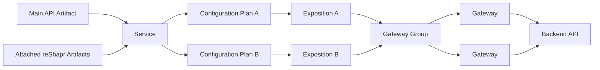

# Service, Artifact, Plan, Exposition, Gateway: The Lifecycle

reShapr separates the description of an API, the MCP surface designed for a consumer, and the place where that surface runs. This separation lets one versioned Service support several agent-facing contracts without duplicating the backend API.

## The resource chain

| Resource | Owns or selects | Why it exists |
|---|---|---|
| **Artifact** | An API contract or an additional reShapr definition | Supplies the source material from which capabilities are derived |
| **Service** | A name, version, API type, operations, and related Artifacts | Represents one versioned API promise |
| **Configuration Plan** | Backend endpoint, operation and Artifact selection, credentials, and runtime policies | Defines one way to consume a Service |
| **Exposition** | One Configuration Plan and one Gateway Group | Makes that Plan available to a target group |
| **Gateway Group** | A logical set of Gateways | Selects where Expositions are distributed |
| **Gateway** | The synchronized Expositions it serves | Exposes MCP endpoints and dispatches calls to backends |

## Artifacts define and enrich a Service

The first imported OpenAPI, GraphQL, or Protocol Buffer definition becomes the Service's **main Artifact**. It determines the Service identity, type, and backend operations. Additional reShapr Artifacts can contribute Prompts, Resources, Custom Tools, or Tool output filters.

The main Artifact is always available to Plans for that Service. Attached reShapr Artifacts are selectable by name through `includedArtifacts`. An empty selection means that all attached Artifacts apply.

Re-importing the main Artifact with the same Service name and version updates that Service and its operations. Attaching a custom Artifact again with the same source replaces its derived content and recalculates the capabilities declared by that Artifact.

## Plans create distinct MCP surfaces

A Service can have several Configuration Plans. Each Plan can choose a different:

- operation allowlist or denylist;
- set of attached Artifacts;
- backend endpoint and credentials;
- endpoint authentication, cache, audit, and output behavior.

This is the boundary at which an API surface becomes a consumer-specific MCP surface. A narrow Plan does not change the Service or another Plan derived from it.

## Expositions place Plans on Gateways

A Configuration Plan is not an endpoint by itself. An Exposition assigns it to a Gateway Group. Connected Gateways in that group receive the Exposition and the selected Artifacts through the control-plane discovery stream.

Updates to a Service, Plan, or selected Artifact are propagated to affected Gateways. This is live configuration propagation, not a guarantee that every in-flight call or infrastructure upgrade is interruption-free.

## Deletion follows dependencies

Deletion has consequences downstream:

- Deleting an Exposition removes that endpoint assignment from its Gateway Group.
- Deleting a Configuration Plan removes its Expositions.
- Deleting a Service removes its Artifacts, Plans, and Expositions.
- Deleting an attached Artifact removes its name from Plans that selected it and propagates the change.

There is one subtle case: if deleting an Artifact leaves a Plan with an empty `includedArtifacts` list, that empty list means **all remaining attached Artifacts apply**. Review the deletion impact before confirming it; a removal can therefore broaden the set selected by that Plan.

## Choose the boundary you intend to change

Change the **Service** when the source API contract changed. Change or attach an **Artifact** when adding agent-oriented capabilities or response treatment. Change a **Plan** when one consumer needs a different surface or policy. Change an **Exposition** or **Gateway Group** when the same Plan must run elsewhere.

Continue with **[From API Contract to Agent Action](./api-to-agent.md)** to follow one request through these resources, or **[Configuration Plan and Exposition](./configuration-and-exposition.md)** for the policy boundary in more detail.

The evolving implementation is owned by the [reShapr runtime repository](https://github.com/reshaprio/reshapr). The [public API contract for release 0.2.3](https://github.com/reshaprio/reshapr/blob/0.2.3/reshapr-public-openapi-v0.1.yaml) is the versioned interface source for executable examples.