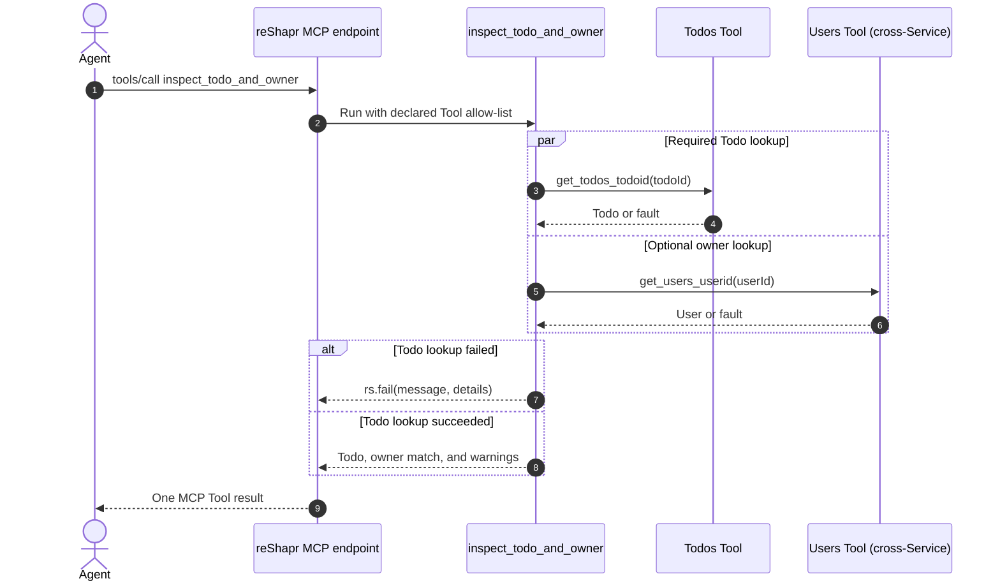

# Build a Scripted Custom Tool

Create one MCP Tool that calls two existing Tools in parallel, combines their results, and handles required and optional failures differently. Then verify the script allow-list and runtime guardrails.

## What you are building

The goal is an agent-facing action named `inspect_todo_and_owner`. Given a Todo ID and an expected owner ID, it fetches both records, checks whether the owner matches, and returns one compact result. The Todo is required, while a failed owner lookup becomes a warning rather than failing the complete action.



An LLM could discover the two primitive Tools, call them itself, carry the intermediate results in its context, correlate their identifiers, and decide how to handle each failure. A Scripted Custom Tool moves that stable workflow into reviewed infrastructure instead. The call graph, concurrency, data combination, and failure policy become deterministic; the Agent plans one Tool call rather than repeatedly reconstructing the orchestration. For this two-call example, parallel execution can avoid serial backend latency and the compact final result can reduce agent-facing calls and intermediate context. The actual latency and token savings remain workload-dependent and should be measured rather than assumed. **[From API Sprawl to Agent Actions](/blog/from-api-sprawl-to-agent-actions)** presents a fuller applied scenario built around the same task-shaped orchestration pattern.

Use this pattern when the sequence represents a reusable business action. Keep orchestration in the Agent when tool choice or call order is intentionally dynamic and depends on open-ended reasoning.

## Prerequisites

- reShapr CLI `0.2.3`, authenticated against reShapr Online or a local `0.2.3` environment
- `curl` and `jq`
- Docker Compose v2 when testing the timeout override on the local stack
- A running proxy registered as a Gateway in Gateway Group `1`
- Outbound access from the control plane to `https://reshapr.io` and from the proxy to `https://jsonplaceholder.typicode.com`

The example uses two small OpenAPI contracts hosted with this documentation. [JSONPlaceholder](https://jsonplaceholder.typicode.com) supplies the public backend data, so no backend credentials are required.

## Import the two Services

Import the Todos and Users contracts:

```bash
reshapr import --url 'https://reshapr.io/examples/scripted-custom-tools/todos-openapi.yaml'
reshapr import --url 'https://reshapr.io/examples/scripted-custom-tools/users-openapi.yaml'
```

Locate the generated Services using structured CLI output:

```bash
TODOS_SERVICE_ID="$(
  reshapr service list --output json \
    | jq -er 'map(select(.name == "Scripted Todos API" and .version == "1.0.0")) | first | .id'
)"
USERS_SERVICE_ID="$(
  reshapr service list --output json \
    | jq -er 'map(select(.name == "Scripted Users API" and .version == "1.0.0")) | first | .id'
)"
export TODOS_SERVICE_ID USERS_SERVICE_ID
```

For REST Services, reShapr derives Tool names from the HTTP method and path. These contracts produce `get_todos_todoid` and `get_users_userid`.

## Expose the cross-Service target

A scripted cross-Service call resolves the target Service's elected Exposition in the same organization. Create and expose the Users Configuration Plan before running the Todos workflow:

```bash
USERS_PLAN_ID="$(
  reshapr config create 'scripted-users-target' \
    --serviceId "$USERS_SERVICE_ID" \
    --backendEndpoint 'https://jsonplaceholder.typicode.com' \
    --includedOperations '["GET /users/{userId}"]' \
    --output json \
    | jq -er '.id'
)"

reshapr expo create \
  --configuration "$USERS_PLAN_ID" \
  --gateway-group 1
```

The Exposition makes `Scripted Users API:1.0.0` resolvable by scripts running in the same organization. It does not expose that Service to scripts in another organization.

## Attach the scripted Artifact

Review the complete **[Scripted Custom Tool Artifact](/examples/scripted-custom-tools/todo-workflow.yaml)**. Its main Tool, `inspect_todo_and_owner`, declares two allowed calls:

```yaml
tools:
  - tool: get_todos_todoid
  - service: Scripted Users API:1.0.0
    tool: get_users_userid
```

An omitted `service` means the same Service as the Custom Tool. A coordinate in the `<service-name>:<service-version>` form selects another Service in the same organization.

Attach the Artifact and retain its generated name:

```bash
SCRIPT_ARTIFACT_NAME="$(
  reshapr attach \
    --url 'https://reshapr.io/examples/scripted-custom-tools/todo-workflow.yaml' \
    --output json \
    | jq -er '.name'
)"
export SCRIPT_ARTIFACT_NAME
```

The `tools` list is an execution allow-list for the script. It does not grant OAuth scopes or implement authorization for individual MCP Tools. Endpoint access remains governed by the Exposition's authentication configuration.

## Expose the scripted Tools

Create a Todos Plan that selects the Artifact, its four scripted capabilities, and the generated operation called by the same-Service script:

```bash
SCRIPTED_TOOLS='[
  "GET /todos/{todoId}",
  "inspect_todo_and_owner",
  "probe_undeclared_tool",
  "exceed_call_limit",
  "recurse_until_limited"
]'
SCRIPTED_ARTIFACTS="$(jq -cn --arg artifact "$SCRIPT_ARTIFACT_NAME" '[$artifact]')"

TODOS_PLAN_ID="$(
  reshapr config create 'scripted-todo-workflow' \
    --serviceId "$TODOS_SERVICE_ID" \
    --backendEndpoint 'https://jsonplaceholder.typicode.com' \
    --includedOperations "$SCRIPTED_TOOLS" \
    --includedArtifacts "$SCRIPTED_ARTIFACTS" \
    --output json \
    | jq -er '.id'
)"

TODOS_MCP_ENDPOINT="$(
  reshapr expo create \
    --configuration "$TODOS_PLAN_ID" \
    --gateway-group 1 \
    --output json \
    | jq -er '.endpoints[0]'
)"
export TODOS_MCP_ENDPOINT
unset SCRIPTED_TOOLS SCRIPTED_ARTIFACTS
```

Scripted calls follow the same Plan operation selection as direct MCP calls. Keeping `GET /todos/{todoId}` selected therefore also leaves its generated `get_todos_todoid` Tool visible on this Exposition. The cross-Service `get_users_userid` Tool is selected on the Users Plan but is not added to the Todos endpoint.

Set the scheme for your environment. reShapr Online uses `https`; the local Compose proxy uses `http`:

```bash
export MCP_URL="https://$TODOS_MCP_ENDPOINT"
```

If the returned endpoint already includes a scheme, assign it directly instead.

## List and call the workflow Tool

Define a helper that sends a stateless MCP `tools/call` request:

```bash
call_tool() {
  local tool_name="$1"
  local arguments="$2"
  local request
  request="$(jq -cn \
    --arg name "$tool_name" \
    --argjson arguments "$arguments" \
    '{
      jsonrpc: "2.0",
      id: 1,
      method: "tools/call",
      params: {
        name: $name,
        arguments: $arguments,
        _meta: {
          "io.modelcontextprotocol/protocolVersion": "2026-07-28",
          "io.modelcontextprotocol/clientInfo": {name: "reshapr-docs", version: "0.2.3"},
          "io.modelcontextprotocol/clientCapabilities": {}
        }
      }
    }')"

  curl --silent --show-error \
    --header 'Content-Type: application/json' \
    --header 'Accept: application/json, text/event-stream' \
    --header 'MCP-Protocol-Version: 2026-07-28' \
    --header 'Mcp-Method: tools/call' \
    --header "Mcp-Name: $tool_name" \
    --data "$request" \
    "$MCP_URL"
}
```

First confirm the scripted capabilities are exposed:

```bash
curl --silent --show-error \
  --header 'Content-Type: application/json' \
  --header 'Accept: application/json, text/event-stream' \
  --header 'MCP-Protocol-Version: 2026-07-28' \
  --header 'Mcp-Method: tools/list' \
  --data '{"jsonrpc":"2.0","id":1,"method":"tools/list","params":{"_meta":{"io.modelcontextprotocol/protocolVersion":"2026-07-28","io.modelcontextprotocol/clientInfo":{"name":"reshapr-docs","version":"0.2.3"},"io.modelcontextprotocol/clientCapabilities":{}}}}' \
  "$MCP_URL" | jq -r '.result.tools[].name'
```

Call the main Tool:

```bash
call_tool 'inspect_todo_and_owner' '{"todoId":1,"userId":1}' \
  | jq -r '.result.content[0].text | fromjson'
```

`rs.callToolAsync(...)` starts both backend calls, and `rs.awaitPromises(...)` returns their results in declaration order. The response contains the compact Todo, its owner, an `ownerMatches` flag, and an empty `warnings` array.

## Handle partial and terminal failures

The owner lookup is optional to the final result. Requesting a missing user demonstrates a partial failure:

```bash
call_tool 'inspect_todo_and_owner' '{"todoId":1,"userId":999}' \
  | jq -r '.result.content[0].text | fromjson'
```

The Tool still succeeds with `owner: null` and a warning. By contrast, the Todo is required. A missing Todo calls `rs.fail(...)` with structured context:

```bash
call_tool 'inspect_todo_and_owner' '{"todoId":999,"userId":1}' | jq .result
```

The MCP result has `isError: true`; its content identifies the Todo and preserves the underlying failure details.

## Verify the script guardrails

### Allow-list

`probe_undeclared_tool` attempts a cross-Service call that is deliberately absent from its `tools` list:

```bash
call_tool 'probe_undeclared_tool' '{}' \
  | jq -r '.result.content[0].text | fromjson'
```

The returned object has `blocked: true` and an invalid-parameters error naming the undeclared Tool. This check applies to script execution only; it is not an OAuth authorization decision.

### Maximum Tool calls

The `0.2.3` default permits 10 underlying Tool calls per script execution. The diagnostic Tool attempts 11:

```bash
call_tool 'exceed_call_limit' '{}' \
  | jq -r '.result.content[0].text | fromjson'
```

The result reports `completedCalls: 10`, `blockedAt: 11`, and the guardrail error.

### Maximum nesting depth

The default nesting depth is 5. Ask the recursive scripted Tool to exceed it:

```bash
call_tool 'recurse_until_limited' '{"remaining":10}' \
  | jq -r '.result.content[0].text | fromjson'
```

The final content has `reachedGuardrail: true` and a `detail` containing the maximum-depth fault returned by the rejected nested call.

### Execution timeout

The default script timeout is 10,000 ms. To exercise this guardrail with the release-pinned local Compose stack, create an override named `scripted-timeout.override.yaml`:

```yaml
services:
  gateway-01:
    environment:
      RESHAPR_GATEWAY_SCRIPTING_TIMEOUT: 1
```

Recreate only the proxy with the one-millisecond test limit:

```bash
docker compose \
  --file "$HOME/.reshapr/docker-compose-0.2.3.yml" \
  --file scripted-timeout.override.yaml \
  up --detach --force-recreate gateway-01
```

Wait until `http://localhost:7777/q/health/ready` reports `UP`, then call `inspect_todo_and_owner` again. The MCP result has `isError: true` and reports `Custom tool script timed out`.

Restore the release default and remove the temporary override:

```bash
docker compose \
  --file "$HOME/.reshapr/docker-compose-0.2.3.yml" \
  up --detach --force-recreate gateway-01

rm scripted-timeout.override.yaml
```

For another deployment model, set `RESHAPR_GATEWAY_SCRIPTING_TIMEOUT` in the proxy workload and perform its normal rolling restart. The timeout cancellation is best effort: it interrupts blocking backend calls and waits, but it cannot forcibly stop a pure CPU loop in the JavaScript engine.

## Result

The Todos MCP endpoint exposes one stable composed action alongside the same-Service generated Tool required by that action. A successful call returns one compact result; optional failures remain visible as warnings, required failures use a structured MCP Tool error, and undeclared or excessive calls are rejected by the proxy.

## Limits

- Scripts can call reShapr Tools only; they cannot make arbitrary network requests.
- Cross-Service calls are limited to the same organization and use the target Service's elected Exposition.
- Every Tool a script may call must appear in its `tools` allow-list, including scripted Tools used for nesting.
- A Tool called on the same Service must also remain selected by the current Plan and is consequently visible to MCP clients.
- The allow-list is not per-Tool OAuth authorization. OAuth scopes apply to the Exposition before MCP dispatch.
- Script timeout, call-count, and depth limits are proxy settings and affect every scripted Tool served by that proxy.
- JSONPlaceholder is a public test backend. Do not use its data or availability as a production dependency.
- Re-running the commands with the same Plan or Exposition names requires deleting or renaming the previous resources.

## Next step

- **[Custom Tools](../references/custom-tools-specification.md#scripted-custom-tools)** is the field and `rs` API reference.
- **[Attach and Select reShapr Artifacts](./select-reshapr-artifacts.md)** explains capability extraction and Plan-level Artifact selection.
- **[Authenticate Backend Calls and Use Elicitation](./security/backend-auth-and-elicitation.md)** adds credentials to underlying Tool calls.
- **[Observe and Audit MCP Calls](./operations/observe-and-audit.md)** configures proxy telemetry for the resulting workflow.