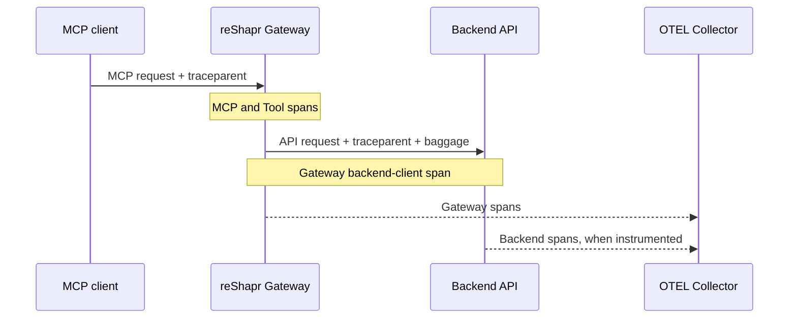

# Observe the reShapr Gateway

Use this guide to export Gateway traces, metrics, and logs with [OpenTelemetry](https://opentelemetry.io/) to an [OpenTelemetry Collector](https://opentelemetry.io/docs/collector/). You will also verify trace propagation to backends, route audit log records independently, and expose the proxy metrics scrape target.

This procedure configures the Gateway telemetry pipeline. Enabling audit for a particular MCP endpoint is a separate Configuration Plan decision.

## Prerequisites

You need:

- a reShapr Gateway `0.2.3` deployed with the proxy chart `0.0.11`;
- an OpenTelemetry Collector endpoint reachable from the Gateway namespace;
- a telemetry backend where you can search exported logs and traces;
- an existing MCP endpoint and an instrumented backend for end-to-end trace verification;
- `kubectl`, Helm, `curl`, and `jq`;
- Prometheus Operator CRDs when enabling the ServiceMonitor.

This guide uses OTLP over HTTP on port `4318`. Adapt the endpoint and protocol together when your collector uses gRPC or requires authentication.

Set the deployment and resource inputs:

```bash
export PROXY_NAMESPACE='reshapr-proxies'
export PROXY_RELEASE='reshapr-proxy'
export OTEL_ENDPOINT='http://otel-collector.observability.svc.cluster.local:4318'
```

## Configure Gateway telemetry

Create a focused Helm values file:

```yaml title="values/proxy-observability.yaml"
extraEnv:
  - name: QUARKUS_OTEL_SDK_DISABLED
    value: "false"
  - name: QUARKUS_OTEL_EXPORTER_OTLP_ENDPOINT
    value: "http://otel-collector.observability.svc.cluster.local:4318"
  - name: QUARKUS_OTEL_EXPORTER_OTLP_PROTOCOL
    value: "http/protobuf"

serviceMonitor:
  enabled: true
  additionalLabels:
    prometheus: kube-prometheus
  interval: 30s
  scrapeTimeout: 10s
```

The proxy chart disables the OpenTelemetry SDK by default to avoid connection errors when no collector is available. The override enables the SDK; the Gateway application enables traces, metrics, and logs in its production profile.

Apply the values to the existing release:

```bash
helm upgrade "${PROXY_RELEASE}" \
  oci://quay.io/reshapr/reshapr-helm-charts/reshapr-proxy \
  --version 0.0.11 \
  --namespace "${PROXY_NAMESPACE}" \
  --reuse-values \
  --values values/proxy-observability.yaml

kubectl rollout status deployment/reshapr-proxy \
  --namespace "${PROXY_NAMESPACE}" \
  --timeout 5m
```

Confirm the rendered OTLP settings without displaying secret headers:

```bash
kubectl get deployment/reshapr-proxy \
  --namespace "${PROXY_NAMESPACE}" \
  --output json \
  | jq '.spec.template.spec.containers[0].env
      | map(select(.name | startswith("QUARKUS_OTEL_")))
      | map({name, value})'
```

The output must show `QUARKUS_OTEL_SDK_DISABLED=false`, the collector endpoint, and `http/protobuf`. Inspect Gateway logs if the collector cannot be reached:

```bash
kubectl logs deployment/reshapr-proxy \
  --namespace "${PROXY_NAMESPACE}" \
  --tail 100
```

## Follow a distributed trace

When an MCP caller supplies a valid W3C trace context, the Gateway continues that trace and contributes spans for MCP request handling, Tool execution, and backend client calls. For HTTP backends, it injects the current [W3C Trace Context](https://www.w3.org/TR/trace-context/) and [W3C Baggage](https://www.w3.org/TR/baggage/) into the outgoing request.



The backend must be instrumented and configured to extract the propagated context before it can contribute its own spans. Collector connectivity alone does not instrument the backend.

Send a known read-only `tools/call` from a client that injects `traceparent`, then search your tracing backend for that trace ID. A complete trace should connect the inbound Gateway request to its Tool and backend-client spans; an instrumented backend should continue the same trace. Use **[Test an MCP endpoint](../test-mcp-endpoint.md)** for the request shape.

These spans let platform engineers separate Gateway processing time from the backend call duration and locate failures at the relevant boundary. Sampling still determines whether all participating spans are retained.

## Route audit logs separately

Audit events use the Gateway's OpenTelemetry Logs pipeline. Every audit record carries `log.type=audit`, allowing the Collector to route it independently from regular application logs. The Gateway does not provide a separate audit database or SIEM integration.

The following bounded Collector example sends non-audit logs to an observability backend and audit logs to a dedicated sink. Adapt exporter endpoints, authentication, TLS, batching, and component availability to your Collector distribution:

```yaml title="otel-collector-config.yaml"
receivers:
  otlp:
    protocols:
      grpc: {}
      http: {}

processors:
  filter/drop_audit:
    error_mode: ignore
    logs:
      log_record:
        - 'attributes["log.type"] == "audit"'
  filter/keep_only_audit:
    error_mode: ignore
    logs:
      log_record:
        - 'attributes["log.type"] != "audit"'
  batch: {}

exporters:
  otlphttp/observability:
    endpoint: https://<observability-backend>
  otlphttp/audit_sink:
    endpoint: https://<siem-or-audit-sink>

service:
  pipelines:
    logs/application:
      receivers: [otlp]
      processors: [filter/drop_audit, batch]
      exporters: [otlphttp/observability]
    logs/audit:
      receivers: [otlp]
      processors: [filter/keep_only_audit, batch]
      exporters: [otlphttp/audit_sink]
```

Collector filter conditions remove matching records. Consequently, `filter/drop_audit` excludes audit records from the application sink, while `filter/keep_only_audit` excludes every non-audit record from the audit sink. To retain audit records in both systems, omit `filter/drop_audit` from the application pipeline.

Review the official [Collector configuration documentation](https://opentelemetry.io/docs/collector/configuration/) and the [filter processor](https://github.com/open-telemetry/opentelemetry-collector-contrib/tree/main/processor/filterprocessor) before applying this pattern. Treat the audit sink as security-sensitive and apply its own access, integrity, retention, and deletion controls.

This routing configuration receives audit records only for Configuration Plans where audit is enabled. Use **[Audit MCP Endpoint Calls](../audit-mcp-endpoint.md)** to activate and verify that endpoint policy.

## Verify proxy metrics

Confirm that the chart created a ServiceMonitor selecting the proxy service:

```bash
kubectl get servicemonitor reshapr-proxy \
  --namespace "${PROXY_NAMESPACE}" \
  --output json \
  | jq '{selector: .spec.selector, endpoints: .spec.endpoints}'
```

The endpoint must use the `http` port, `/q/metrics` path, `30s` interval, and `10s` timeout. Confirm in Prometheus that the corresponding target is up.

To inspect the metrics without exposing the management endpoint through ingress, start a local port-forward in another terminal:

```bash
kubectl port-forward \
  --namespace "${PROXY_NAMESPACE}" \
  service/reshapr-proxy 7777:7777
```

Then query the metrics endpoint:

```bash
curl --fail --silent http://localhost:7777/q/metrics | head
```

The ServiceMonitor only configures discovery and scraping. Your Prometheus installation owns target selection, retention, recording rules, alerts, and dashboards.

## Roll back

To stop exporting telemetry, remove the observability overrides from the release values or restore `QUARKUS_OTEL_SDK_DISABLED=true`, then upgrade the release again. Disable `serviceMonitor.enabled` separately if Prometheus must stop scraping the proxy.

## Result

The Gateway exports traces, metrics, and logs to your Collector, continues distributed traces across HTTP backend calls, and exposes a Prometheus scrape target. Audit records can follow a dedicated Collector pipeline based on `log.type=audit`.

## Limits

- Release `0.2.3` proves OpenTelemetry behavior for the Gateway. It does not establish equivalent coverage for the control plane, Web UI, operator, or admission controller.
- End-to-end traces require callers and backends to propagate compatible trace context and export their own spans.
- Telemetry export depends on the OpenTelemetry SDK, Collector connectivity, configured pipelines, sampling, and backend retention.
- Audit records appear only for Configuration Plans where audit is enabled.
- The proxy ServiceMonitor does not install Prometheus Operator or create alerts and dashboards.
- Telemetry can contain organization, service, user, source-address, and target metadata. Apply access controls and retention appropriate to that data.

## Next step

Use **[Audit MCP Endpoint Calls](../audit-mcp-endpoint.md)** to enable audit on a Configuration Plan. Use **[Troubleshoot an Exposition or Gateway](./troubleshoot.md)** to choose the relevant signal for a failed request.

The release-tagged [Gateway telemetry configuration](https://github.com/reshaprio/reshapr/blob/0.2.3/proxy/src/main/resources/application.properties) and [proxy chart values](https://github.com/reshaprio/reshapr-helm-charts/blob/0.0.11/proxy/values.yaml) remain the canonical configuration references.