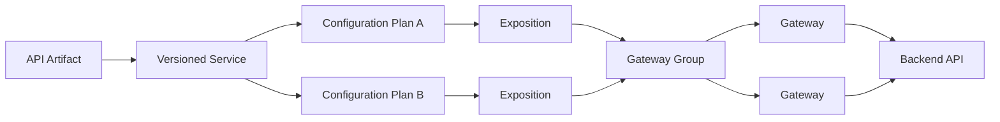

# How It Works

reShapr is a zero-code AI translation layer. Instead of building an MCP server from scratch, you can use reShapr to instantly translate your existing APIs (REST, gRPC, GraphQL) into AI-native endpoints.

With reShapr, you can create secure MCP servers in seconds without coding by connecting the platform to your existing API artifacts.

As of today, reShapr supports ingesting:

- [OpenAPI 3.x specifications](https://spec.openapis.org/oas/latest.html)
- [GraphQL schemas](https://spec.graphql.org/)
- [gRPC](https://grpc.io/docs/what-is-grpc/introduction/) / [Protocol Buffer definitions](https://protobuf.dev/programming-guides/proto3/)

## From API artifact to MCP endpoint

An imported API artifact defines a versioned Service and its operations. A Configuration Plan then selects the operations and attached reShapr Artifacts to expose, identifies the backend, and applies endpoint policies. An Exposition assigns that Plan to a Gateway Group, whose running Gateways serve the resulting MCP endpoint.

One Service can therefore produce multiple MCP surfaces. For example, one Plan can expose a small read-only surface while another includes a business-oriented Custom Tool and an output filter.

**Context Control** applies at two complementary points:

- At configuration time, a Plan selects Service operations and attached Prompts, Resources, Custom Tools, and output filters.
- At call time, the selected filters and output encoding can reduce or reshape a Tool response before it returns to the MCP client.

Once reShapr discovers your services, you configure:

- Security mechanisms
- Exposition options (all operations, read-only operations, etc.)
- Existing backend endpoint targets

Then reShapr exposes your MCP server through gateways in a multi-tenant and secure way.

:::info Core Architecture
At the core of reShapr is a robust architecture built to support service-level objectives and location constraints.

The platform has two major parts:

- **Control plane**: centralizes exposition configuration and policies.
- **Data plane**: gateways that expose MCP servers and route runtime traffic.
:::

This architecture supports multiple deployment models:

1. **Cloud**: reShapr hosts both the control plane and the data plane.
2. **Hybrid**: you host some gateways in your own trust domain while reShapr manages control.
3. **On-premises**: both control and data planes in your own environment.

This is what flexibility means for enterprise MCP adoption.

See also:

- **[Why reShapr?](./why-reshapr.md)**
- **[Services and Artifacts](../explanations/services-and-artifacts.md)**
- **[Configuration Plan and Exposition](../explanations/configuration-and-exposition.md)**
- **[Security Options and Secrets](../explanations/security-model.md)**
- **[Hybrid Deployment](../how-to-guides/deploy-hybrid-gateway.md)**
